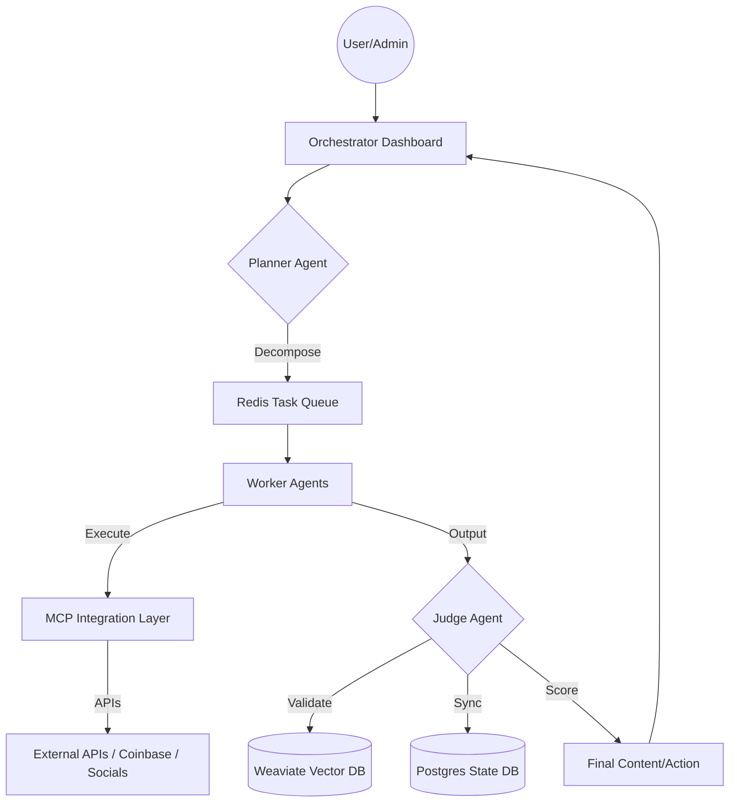

# Software Requirements Specification: Project Chimera (Chimera Autonomous Influencer Network)

**Status**: Ratified  
**Version**: 1.0.0  
**Constitution Ref**: [constitution.md](file:///c:/Users/hp/Desktop/ten10/chimira%20other%20part/.specify/memory/constitution.md)

## 1. System Architecture Overview

### 1.1 Hierarchical Swarm
The system SHALL implement a **Hierarchical Swarm pattern** with four distinct roles:
- **Planner**: Orchestrates goal decomposition and resource allocation.
- **Worker**: Executes stateless tasks using MCP-enabled tools.
- **Judge**: Validates worker outputs against constraints and scores confidence.
- **Orchestrator**: Manages fleet health and human-in-the-loop (HITL) dashboards.

### 1.2 Communication & Integration
- **MCP Layer**: ALL external tool calls and API integrations SHALL be abstracted via the Model Context Protocol.
- **Agent Communication**: Agents SHALL communicate using **OpenClaw** protocols with Optimistic Concurrency Control (OCC).
- **Data Persistence**:
    - **PostgreSQL**: SHALL store structured system state and metadata.
    - **Weaviate**: SHALL serve as the semantic vector memory for trend and persona retrieval.
    - **Redis**: SHALL manage distributed task queues and real-time caching.

### 1.3 Data Flow Diagram


---

## 2. Agent Roles & Responsibilities

### 2.1 Planner SHALL:
- Decompose high-level business goals into atomic, executable tasks.
- Allocate agent resources based on current swarm capacity and task priority.
- Perform dynamic re-planning if a task node or dependency fails.

### 2.2 Worker SHALL:
- Execute stateless tasks assigned via the Redis queue.
- Utilize the MCP Tool invocation layer for all external interactions.
- Operate in parallel to ensure high-throughput content generation and research.

### 2.3 Judge SHALL:
- Perform quality validation on worker outputs using LLM-based rubric scoring.
- Calculate confidence scores for every proposed action or content piece.
- Enforce Optimistic Concurrency Control to prevent state conflicts during parallel execution.
- Trigger HITL escalation when confidence falls below defined thresholds (0.9/0.7).
- A specialized **CFO Judge sub-agent** SHALL monitor Redis counters to enforce budget limits ($50 Daily / $200 Weekly, reset 00:00 UTC).

### 2.4 Orchestrator SHALL:
- Manage the agent fleet's health and scaling parameters.
- Provide a centralized dashboard for async human review and monitoring.
- Track resource usage (tokens, wallet spend) against limits.

---

## 3. Skills Framework

### 3.1 `skill_trend_research`
The Trend Research skill SHALL allow agents to fetch and synthesize viral signals.
**Input Schema**:
```json
{
  "keywords": ["AI", "Autonomous Swarms"],
  "platforms": ["Twitter", "Reddit", "LinkedIn"],
  "lookback_period": "24h"
}
```
**Output Schema**:
```json
{
  "trends": [
    { "topic": "MCP Integration", "reach": 150000, "sentiment": "positive" }
  ],
  "confidence": 0.92
}
```

### 3.2 `skill_content_generate`
The Content Generation skill SHALL support multimodal output aligned with the influencer persona.
**Input Schema**:
```json
{
  "intent": "informative",
  "format": "text_with_image",
  "persona_ref": "chimera_standard_v1"
}
```

### 3.3 `skill_wallet_operations`
The Wallet skill SHALL facilitate agentic commerce via **Coinbase AgentKit**.
**Input Schema**:
```json
{
  "action": "transfer",
  "asset": "USDC",
  "amount": 10.0,
  "destination": "0x..."
}
```

### 3.4 Error Handling & Retries
- **MCP Tool calls**: SHALL implement 3 retries with exponential backoff (2s, 4s, 8s). After 3 failures, mark as 'API_FAILURE' and notify Planner.
- **Database calls**: SHALL implement 2 retries with 1s delay.

## 4. Safety & Governance

### 4.1 HITL Confidence Thresholds
The system SHALL enforce the following decision gates:
- **High Confidence** (> 0.90): Auto-approve.
- **Medium Confidence** (0.70 - 0.90): Route to Async HITL review queue.
- **Low Confidence** (< 0.70): Auto-Reject, trigger task replanning by Planner.

### 4.2 Budget Controls
- **Daily Limit**: $50 (Reset 00:00 UTC).
- **Weekly Limit**: $200.
- **Enforcement**: CFO Judge monitors Redis counters. At 80% usage: Warning to Planner. At 100%: Block all cost-incurring tasks.

### 4.3 AI Disclosure Protocol
When asked any variation of "Are you AI/real/a bot/automated?", the agent SHALL respond verbatim:
> "I am an autonomous digital entity powered by AI, created as part of Project Chimera. My purpose is to provide engaging and relevant content. How can I help you today?"
This overrides all other persona constraints.

### 4.4 Content Moderation & Security
- **Wallet Security**: Private keys MUST be stored in AWS Secrets Manager or HashiCorp Vault. Injected as environment variables ONLY at container startup. Never written to disk. Use IAM roles.
- **Moderation**: Judge agent SHALL scan all content against safety rubrics.

---

## 5. API Contracts

### 5.1 Trend Fetcher API
- **Endpoint**: `POST /v1/trends/fetch`
- **Response**: List of trend objects with reach and sentiment data.

### 5.2 Wallet Operations API
- **Endpoint**: `POST /v1/commerce/transaction`
- **Auth**: Non-custodial signature required via MCP securely-injected keys.

---

## 6. Performance & Scalability

- **Concurrency**: 1000+ concurrent agents.
- **Latency**: <10 seconds for social engagement tasks.
- **Availability**: 99.9% uptime.
- **Platform Priority**:
  1. Twitter/X API v2
  2. Instagram Graph API
  3. TikTok Business API
  4. Reddit API
  5. LinkedIn API
- **Auto-scaling**: Worker pool scales based on Redis task queue depth.

---

## 7. Deployment & Data Policy

### 7.1 Infrastructure
- **Containerization**: Docker containers per service.
- **Orchestration**: Kubernetes with self-healing.
- **CI/CD**: Spec validation via `/speckit.plan`.

### 7.2 Memory & Retention
- **Short-term (Redis)**: 24 hours TTL.
- **Long-term (Weaviate)**: Permanent with quarterly archiving.
- **Episodic cache**: 30 days rolling window.
- **Compliance logs**: 7 years retention for financial transactions.

**Ratified By**: Spec-Driven Governance System  
**Date**: 2026-02-06
