# Project Chimera: Architecture Strategy Document
*Date: February 4, 2026*
*Author: FDE Trainee*

## **Executive Summary**
This document outlines the architectural strategy for Project Chimera - an autonomous influencer network. We define the agent patterns, human safety layers, and database architecture to enable scalable, reliable AI influencers.

---

## **1. Agent Pattern Selection**

### **1.1 Problem Analysis**
We need an agent architecture that supports:
- **Parallel content creation** (research, writing, editing simultaneously)
- **Quality assurance** (brand-safe content)
- **Fault tolerance** (single failures don't crash system)
- **Scalability** (1000+ concurrent agents)

### **1.2 Pattern Evaluation**

**Option A: Sequential Chain**

*✅ Simple to implement*  
*❌ Single point of failure*  
*❌ No parallel execution*  
*❌ Bottlenecks at each step*

**Option B: Hierarchical Swarm (FastRender)**

```mermaid
graph TD
    P[🤔 Planner<br/>Campaign Strategy] --> W1[✍️ Worker<br/>Content Writing]
    P --> W2[🎨 Worker<br/>Visual Design]
    P --> W3[📊 Worker<br/>Analytics]
    
    W1 --> J[✅ Judge<br/>Quality Control]
    W2 --> J
    W3 --> J
    
    J -->|Approve| O[🎉 Published Content]
    J -->|Reject| P
    J -->|Human Review| H[👥 HITL Queue]
```

*✅ Parallel execution*  
*✅ Fault isolation*  
*✅ Built-in quality control*  
*✅ Horizontal scalability*

### **1.3 Decision: Hierarchical Swarm**

**Why Selected:**
1. **Content creation is parallelizable** - Different workers can handle different aspects simultaneously
2. **Quality is non-negotiable** - Judge ensures all outputs meet standards
3. **Scalability is critical** - Can add workers without redesign
4. **Reliability matters** - Worker failures don't stop the system

**Real-world Analogy: Movie Production Crew**
```
Director (Planner) → Sets vision
Crew (Workers) → Execute specialized tasks
Editor (Judge) → Ensures final quality
```

---

## **2. Human-in-the-Loop Strategy**

### **2.1 Safety Requirements**
- Prevent inappropriate/brand-damaging content
- Handle sensitive topics (politics, health, finance)
- Control financial transactions
- Provide human override capability

### **2.2 Three-Tier Safety Architecture**

```mermaid
flowchart TD
    A[Agent Creates Content] --> B{Judge Evaluation}
    
    B --> C1[Confidence > 90%]
    C1 --> D1[🎉 Auto-Approved<br/>Immediate Action]
    
    B --> C2[Confidence 70-90%]
    C2 --> D2[📋 Async Human Review<br/>Agent continues other work]
    D2 --> E{Human Decision}
    E --> F1[✅ Approve]
    E --> F2[✏️ Edit & Approve]
    E --> F3[❌ Reject]
    
    B --> C3[Confidence < 70%]
    C3 --> D3[🔄 Immediate Retry<br/>Refine approach]
    
    B --> C4[Sensitive Topic]
    C4 --> D4[⚠️ Mandatory Human Review<br/>No auto-approval]
    
    B --> C5[Financial Transaction]
    C5 --> D5[💰 CFO Judge Review]
    D5 --> E2{Budget Check}
    E2 -->|Within Limit| F4[Auto-Approve]
    E2 -->|Exceeds Limit| D4
    
    F1 --> G[📱 Publish Content]
    F2 --> H[Return to Agent]
    F3 --> I[Task Queue]
    D1 --> G
    F4 --> G
    H --> I
    D3 --> I
    
    I --> J[Planner<br/>Reassign Tasks]
    D4 --> K[HITL Dashboard]
    K --> E
```



### **2.3 Human Dashboard Design**
```
HUMAN DASHBOARD COMPONENTS:
┌─────────────────────────────────────┐
│ 📊 DASHBOARD                        │
├─────────────────────────────────────┤
│ 🔴 Priority Queue (5 items)         │
│   • Political content - HIGH RISK   │
│   • Large transaction - $500        │
│   • First-time action               │
│   • Low confidence (65%)            │
│   • Sensitive health topic          │
├─────────────────────────────────────┤
│ 🟡 Review Queue (12 items)          │
│   • Routine content review          │
│   • Medium confidence items         │
├─────────────────────────────────────┤
│ 🟢 Auto-Approved (142 today)        │
│   • High confidence content         │
│   • Routine transactions            │
└─────────────────────────────────────┘

ACTION BUTTONS:
• ✅ Approve  • ✏️ Edit  • ❌ Reject
• ⏸️ Pause Agent  • 📊 View Analytics
```

### **2.4 Response Time SLAs**
| Priority | Maximum Wait Time | Notification |
|----------|-------------------|--------------|
| Critical | 5 minutes | Push notification + SMS |
| High | 30 minutes | Email + Dashboard alert |
| Normal | 4 hours | Dashboard queue |
| Low | 24 hours | Batch processing |

---

## **3. Database Architecture**

### **3.1 Data Characteristics Analysis**


### **3.2 SQL vs NoSQL Comparison Matrix**

| Feature | PostgreSQL (SQL) | MongoDB (NoSQL) | Our Need |
|---------|-----------------|-----------------|----------|
| **Video Metadata** | ✅ Excellent | ⚠️ Good | **SQL** - Complex queries |
| **High Velocity Writes** | ⚠️ Good | ✅ Excellent | **Mixed** - Need both |
| **Data Consistency** | ✅ Strong | ⚠️ Eventual | **SQL** - Financial data |
| **Flexible Schema** | ⚠️ Limited | ✅ Excellent | **NoSQL** - Evolving metadata |
| **Complex Queries** | ✅ Excellent | ❌ Limited | **SQL** - Analytics |
| **Horizontal Scale** | ⚠️ Complex | ✅ Easy | **NoSQL** - For some data |

### **3.3 Our Solution: Polyglot Persistence**


### **3.4 PostgreSQL Schema for Video Metadata**

```sql
-- Partitioned video metadata table
CREATE TABLE video_metadata (
    -- Core identifiers
    video_id UUID NOT NULL,
    agent_id UUID NOT NULL,
    tenant_id UUID NOT NULL,
    
    -- Content metadata
    title VARCHAR(500),
    description TEXT,
    duration_seconds INTEGER,
    file_format VARCHAR(10),
    resolution VARCHAR(20),
    file_size_bytes BIGINT,
    
    -- Engagement metrics (updated in real-time)
    views_count BIGINT DEFAULT 0,
    likes_count BIGINT DEFAULT 0,
    comments_count BIGINT DEFAULT 0,
    shares_count BIGINT DEFAULT 0,
    watch_time_seconds BIGINT DEFAULT 0,
    
    -- Content classification
    tags JSONB,
    categories VARCHAR(100)[],
    sentiment_score FLOAT,
    ai_generated BOOLEAN DEFAULT true,
    
    -- Generation metadata
    generation_model VARCHAR(100),
    generation_cost_usd DECIMAL(10,4),
    confidence_score FLOAT CHECK (confidence_score >= 0 AND confidence_score <= 1),
    
    -- Platform info
    platform VARCHAR(50) NOT NULL,
    platform_video_id VARCHAR(100),
    
    -- Temporal data
    created_at TIMESTAMPTZ DEFAULT NOW() NOT NULL,
    scheduled_publish_time TIMESTAMPTZ,
    actual_publish_time TIMESTAMPTZ,
    last_updated TIMESTAMPTZ DEFAULT NOW(),
    
    -- Moderation status
    moderation_status VARCHAR(20) DEFAULT 'pending',
    approved_by UUID,
    approval_time TIMESTAMPTZ,
    rejection_reason TEXT,
    
    -- Partition key
    PRIMARY KEY (video_id, created_at)
) PARTITION BY RANGE (created_at);

-- Create monthly partitions
CREATE TABLE video_metadata_2026_02 PARTITION OF video_metadata
    FOR VALUES FROM ('2026-02-01') TO ('2026-03-01');

-- Indexes for performance
CREATE INDEX idx_video_agent ON video_metadata(agent_id);
CREATE INDEX idx_video_platform ON video_metadata(platform, created_at DESC);
CREATE INDEX idx_video_engagement ON video_metadata(views_count DESC, created_at DESC);
CREATE INDEX idx_video_moderation ON video_metadata(moderation_status, created_at);
CREATE INDEX idx_video_tags_gin ON video_metadata USING GIN(tags);
```

### **3.5 Performance Optimization Strategy**

**For High Velocity Writes:**
1. **Batch inserts** - Group multiple video records
2. **Connection pooling** - PgBouncer for PostgreSQL
3. **Write-behind cache** - Redis buffers then flushes to PostgreSQL
4. **Asynchronous processing** - Don't block on write confirmation

**For Analytics Queries:**
1. **Read replicas** - Separate analytics from transactional DB
2. **Materialized views** - Pre-compute common aggregations
3. **Time-series optimization** - Partition by time ranges
4. **Columnar storage** - ClickHouse for analytical queries

---

## **4. Complete System Architecture**


### **4.1 Key Components Explained**

**Planner Agents:**
- Receive high-level goals from humans
- Break down into executable tasks
- Monitor trends and adjust strategy
- Manage resource allocation

**Worker Pool:**
- Stateless execution units
- Specialized skills (writing, editing, design)
- Auto-scaling based on workload
- Isolated failures don't affect others

**Judge Pool:**
- Quality assurance gatekeepers
- Confidence scoring algorithms
- Escalation decision makers
- Continuous learning from human feedback

**CFO Judge:**
- Specialized financial oversight
- Budget enforcement
- Anomaly detection
- Compliance verification

---

## **5. Implementation Roadmap**

### **Phase 1: Foundation (Weeks 1-2)**
```
✅ Task Queue System (Redis)
✅ Basic Planner-Worker-Judge framework
✅ PostgreSQL schema implementation
✅ Simple HITL dashboard
```

### **Phase 2: MCP Integration (Weeks 3-4)**
```
✅ Twitter/Instagram MCP servers
✅ Weaviate integration for memory
✅ Content generation pipelines
✅ Enhanced HITL with confidence scoring
```

### **Phase 3: Agentic Commerce (Weeks 5-6)**
```
✅ Coinbase AgentKit integration
✅ Wallet management system
✅ Financial governance layer
✅ Transaction monitoring
```

### **Phase 4: Scaling & Optimization (Weeks 7-8)**
```
✅ Horizontal scaling of worker pools
✅ Database partitioning and replication
✅ Performance monitoring
✅ Advanced analytics dashboard
```

---

## **6. Risk Mitigation**

### **Technical Risks:**
1. **Database Performance** - Solved with polyglot persistence + partitioning
2. **API Rate Limiting** - Solved with MCP layer + intelligent queuing
3. **Content Quality** - Solved with Judge agents + HITL
4. **Cost Control** - Solved with CFO Judge + budget limits

### **Business Risks:**
1. **Regulatory Compliance** - Built-in AI disclosure + audit trails
2. **Brand Safety** - Multi-layer moderation system
3. **Platform Changes** - MCP abstraction layer
4. **Cost Overruns** - Resource governor + spending caps

---

## **7. Conclusion**

This architecture provides:
1. **Scalability** - Hierarchical swarm supports thousands of agents
2. **Safety** - Comprehensive HITL with confidence-based escalation
3. **Performance** - Optimized database strategy for video metadata
4. **Flexibility** - MCP-based integration for future platforms
5. **Reliability** - Fault-tolerant design with multiple failovers

The combination of **Hierarchical Swarm agents**, **confidence-based HITL**, and **polyglot database persistence** creates a robust foundation for autonomous influencer operations at scale.