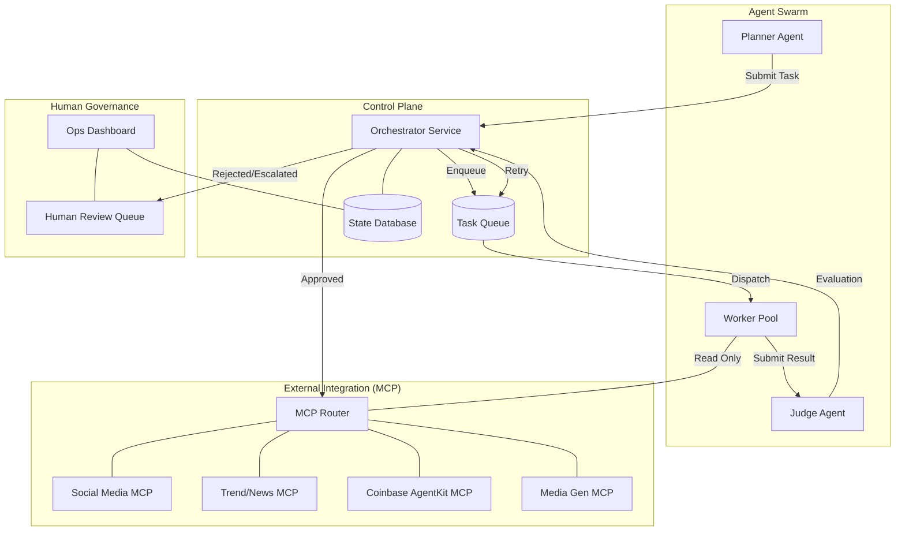

# System Architecture Specification
**Project**: Chimera Autonomous Influencer Network
**Status**: APPROVED
**Source**: Derived from `specs/chimera/functional/srs.md`

## 1. Architectural Pattern: Hierarchical Swarm (FastRender)

The system manages autonomous influencer agents using a **Hierarchical Swarm** pattern, specifically the **FastRender** variation which emphasizes decoupled planning, execution, and verification.

### 1.1 Core Principles
1.  **Separation of Concerns**: Strategizing (Planner), Executing (Worker), and Validating (Judge) are distinct implementation domains.
2.  **Stateless Execution**: Workers do not hold long-term state; they receive a Task and return a Result.
3.  **Policy-as-Code**: The Judge enforces governance via executable policy, not vague prompts.
4.  **Integration Abstraction**: All external side-effects (Social, Financial, Data) are mediated strictly through **MCP Servers**.
    - **Primary Platform**: Twitter/X API (v2) is the priority 1 integration.

### 1.2 Performance SLAs
- **Trend Ingestion to Content Generation**: < 5 minutes.
- **User Comment to Agent Reply**: < 10 minutes.

### 1.3 Component Architecture

## 2. Component Specifications

### 2.1 Orchestrator Service
**Role**: The central nervous system and state manager.
- **Responsibilities**:
    - Manages the lifecycle of `Task` and `Result` objects.
    - Dispatches tasks to Workers based on `skill` matching.
    - Routes Judge evaluations (Approve -> Execute Side Effect, Reject -> Retry, Escalate -> HITL).
    - Maintains the "System of Record" for all agent activities.
- **Key Constraints**:
    - Must be highly available.
    - Must ensure exactly-once delivery of approved side-effects.

### 2.2 Planner Agent (Strategist)
**Role**: High-level campaign manager.
- **Responsibilities**:
    - Monitoring campaign goals (e.g., "Grow IG audience by 10%").
    - Decomposing goals into actionable `Tasks` (e.g., "Trend Research", "Create Post").
    - Prioritizing the backlog.
- **I/O Boundary**:
    - Input: Campaign Config, Performance Metrics.
    - Output: `Task` objects.
    - **NO** direct external API access.

### 2.3 Worker Pool (Executors)
**Role**: Scalable, specialized execution units.
- **Responsibilities**:
    - Executing a single `Task` using a specific `skill`.
    - Interacting with MCP servers to gather data (Read) or stage content (Write-Staging).
    - **NEVER** authorized to commit final publishes or financial transactions directly.
- **I/O Boundary**:
    - Input: `Task`.
    - Output: `Result` (Artifacts + Evidence).
    - Access: Read-Only access to most MCPs; Write access only to Staging/Draft endpoints.

### 2.4 Judge Agent (Validator)
**Role**: Quality Assurance and Safety Compliance.
- **Responsibilities**:
    - Evaluating a `Result` against defined Policies.
    - assigning a `confidence_score`.
    - Determining the Next Action (Approve/Reject/Escalate).
- **I/O Boundary**:
    - Input: `Task` + `Result` + `Policy`.
    - Output: `Evaluation` (Decision).

## 3. Data Flow & Lifecycle

### 3.1 The "Task" Lifecycle
1.  **Created**: Planner generates Task.
2.  **Queued**: Orchestrator validates and persists Task.
3.  **Assigned**: Orchestrator hands Task to a Worker.
4.  **Executed**: Worker produces Result.
5.  ** adjudicated**: Judge evaluates Result.
6.  **Finalized**:
    - **Approved**: Orchestrator triggers the Side Effect via MCP.
    - **Rejected**: Orchestrator schedules Retry (if attempts < max).
    - **Escalated**: Orchestrator moves to HITL Queue.

### 3.2 FastRender Optimization
To achieve the 1,000+ agent scale:
- **Async Processing**: All inter-agent communication is asynchronous via message queues.
- **Stateless Workers**: Workers can be spun up/down dynamically based on queue depth.
- **Optimistic Concurrency**: Planners can queue weeks of content; Workers process in parallel; Judges approve in bulk.
